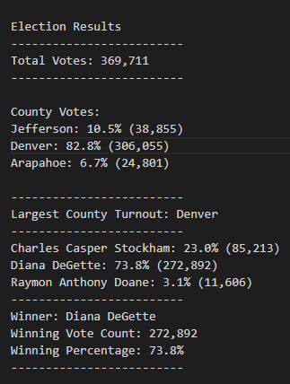

# Election_Analysis

## Overview of Election Audit: 

This project summarizes election election results for some counties in Colorado. The election commission has requested some additional data to complete the audit for:
 
	- The voter turnout for each county

	- The percentage of votes from each county out of the total count 

	- The county with the highest turnout

For loops and conditional statements with membership and logical operators to find the requested results. 
 

### Election-Audit Results: 

Below is the outcome of the election results:

- The total number of votes cast was 369, 711

- Candidates 

	- Charles Casper Stockham

	- Diana DeGette: 

	- Raymon Anthony Doane

- Election results for all the candidates

	- Charles Casper Stockham: 23.0% (85,213)

	- Diana DeGette: 73.8% (272,892)

	- Raymon Anthony Doane: 3.1% (11,606)

- Diana DeGette was elected as the the winner with a winning percentage of 73.8% and a vote count of 272, 892

- County voter turnout

	- Jefferson county had 10.5% of the votes out of a total of 38,855 voters.

	- Denver county had  82.8% of the votes out of a total of 306,055 voters.

	- Arapahoe county had 6.7% of the votes out of a total of  24,801 voters.

-Denver had the largets voter turnout of  82.8% of the total number of voters (306, 055).

### Election-Audit Summary: 

Efficiently developed code that analyzed election results with a large data set. Code can easily be modified to carry out state and federal elections. Data visualization through charts can easily be produced to provide an option for people who prefer them.
